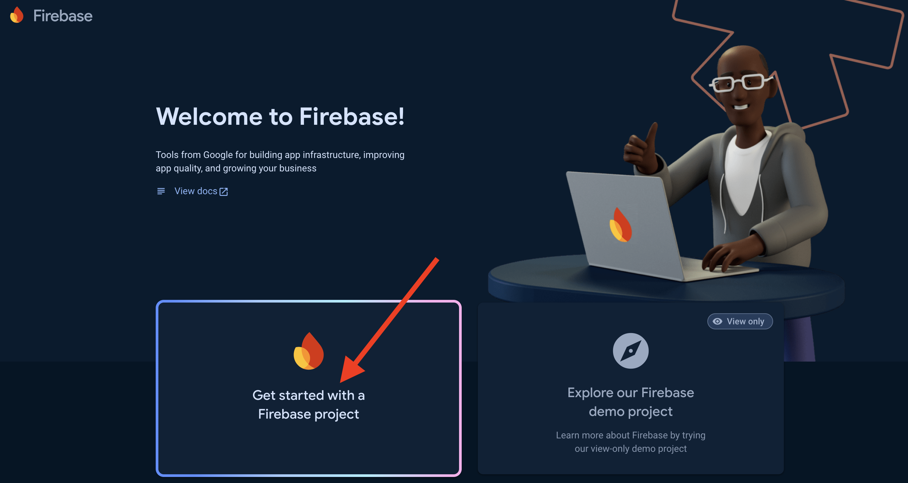
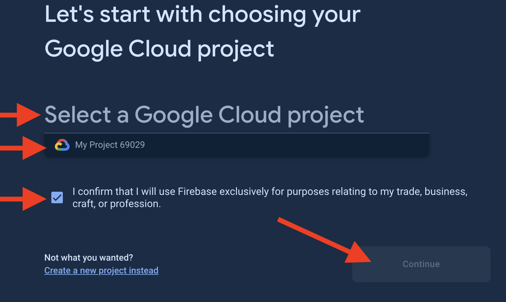
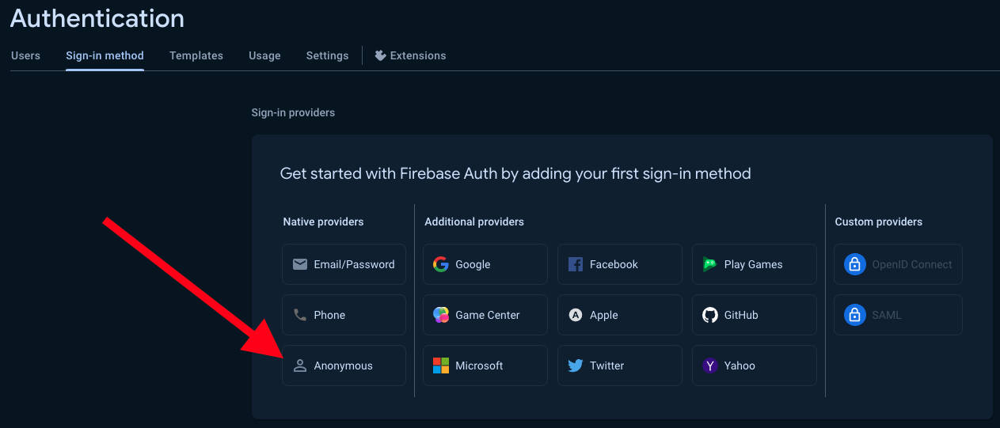
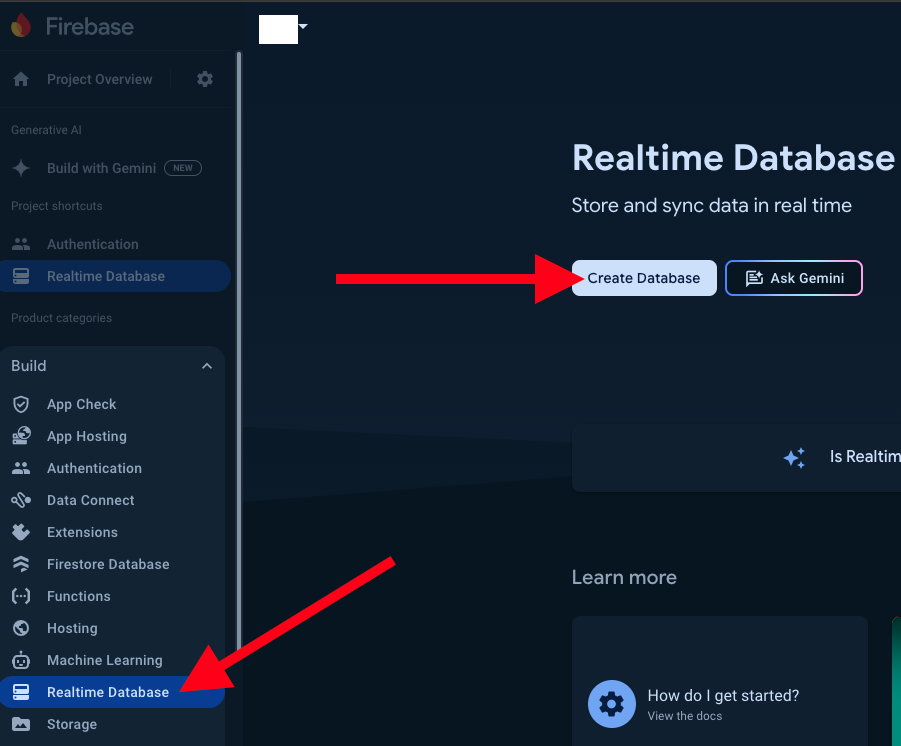
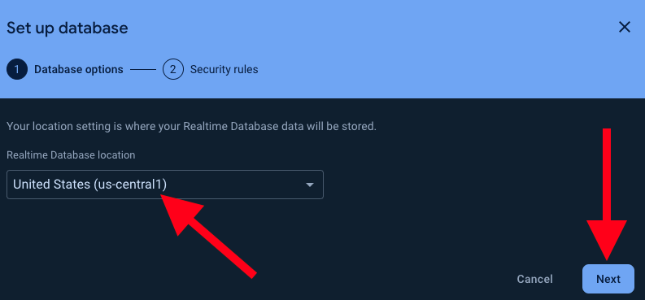
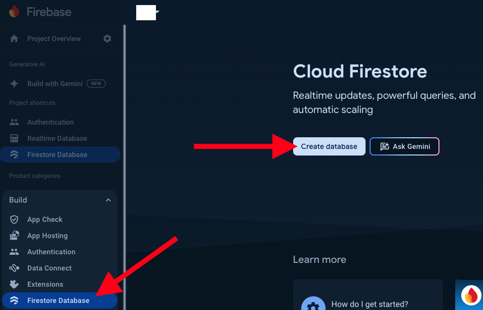

---
hide:
  - navigation
  - toc
---

# SANS SEC510 Cloud Security Simulator Setup Guide (J02)

SEC510 students can follow these instructions to build the labs in their personal AWS, Azure, and Google cloud accounts. Doing so allows students to complete the labs after access to the SANS provisioned accounts is expired. Cost estimates vary by cloud provider:

- AWS free tier eligible accounts are expected to cost roughly $10 USD per day for the AWS resources (including the cloud simulator instance). Make sure you stop the cloud simulator instance when you are not using it.

- Azure Pay as You Go (PAYG) subscriptions are expected to cost roughly $5 USD per day for the Azure resources.

- Google Cloud projects are expected to cost roughly $5 USD per day for the Google Cloud resources.

To limit costs, please make sure to run the **Lab 5.4: Tear Down** script in the electronic workbook when you are not using the lab environment.

!!! warning "YOUR Financial Responsibility"

    When running the Cloud Security Flight Simulator and performing the corresponding labs in your personal AWS, Azure, and Google Cloud environments, **YOU** are responsible for all costs.

!!! warning "BEWARE OF SECURITY RISKS"

    We will be deploying purposefully vulnerable applications and infrastructure to these accounts. This is necessary to illustrate the dangers of insecure cloud environments and how to mitigate the risk they introduce.

    While we take precautions to keep students safe, **SANS cannot guarantee that these accounts will be protected.**

    We recommend monitoring your accounts for unexpected activity. You should also consider canceling your billing when you are done with your lab environment. Here are instructions on how to do this:

    - [Close your AWS account](https://aws.amazon.com/premiumsupport/knowledge-center/close-aws-account/){ target="_blank" rel="noopener" }
    - [Cancel your Azure subscription](https://docs.microsoft.com/en-us/azure/cost-management-billing/manage/cancel-azure-subscription){ target="_blank" rel="noopener" }
    - [Shutting down GCP projects](https://cloud.google.com/resource-manager/docs/creating-managing-projects#shutting_down_projects){ target="_blank" rel="noopener" }

## Cloud Simulator Deployment

### Requirements

- Details found in Course Materials Downloads "Lab Setup Instructions" guide:
    - Firefox + [SmartProxy (by Salar K)](https://addons.mozilla.org/en-US/firefox/addon/smartproxyextension/){:target="_blank"}
    - SANS Cloud Security [CA Certificate](https://sec510.com/ca){:target="_blank"}
- Provided by you:
    - AWS personal account with administrator credentials
    - [Terraform 1.4](https://www.terraform.io/){:target="_blank"} or later
    - [AWS CLI](https://aws.amazon.com/cli/){:target="_blank"}
- Provided by the SEC510 instructor or OnDemand SME:
    - Cloud flight simulator AMI shared to your personal AWS account
    - Commands to set the Terraform variables and apply the template

### Step by Step Instructions

1. Configure your AWS CLI with administrator credentials for your AWS Account.

    ```bash
    aws configure
    ```

- Create a new working directory for running the Terraform deployment.

    ```bash
    mkdir ~/sec510
    cd ~/sec510
    ```

- Download the [sec510-j02.tf](./assets/sec510-j02.tf) launch template (e.g. *sec510-j02.tf*) into the `~/sec510` directory.

- After sharing the AMI with your personal AWS account, the instructor or OnDemand SME will give you the commands to set the required Terraform variables and apply the template. Run those commands in the `~/sec510` directory.

- The `terraform apply` command will take a few minutes to complete. Once it is finished, you will see the following:

    - The `environment_summary` output contains the information you need to connect to the Cloud Security Flight Simulator.

    - *SmartProxy Config* - The name of the SmartProxy configuration file created by Terraform in the `~/sec510` directory.

    - *SSH + SOCKS Connect Command* - The command to connect to the Cloud Security Flight Simulator using SSH and the SOCKS proxy using the private key created by Terraform in the `~/sec510` directory.

    ```plain
    Apply complete! Resources: 16 added, 0 changed, 0 destroyed.

    Outputs:

    environment_summary = <<END_SUMMARY
    Latest AMI:  ami-089891d11fdf14393 - sans-sec510-j02.24.2.1
    Running AMI: ami-089891d11fdf14393
    Public IP:   18.227.81.85

    Local IP:          11.222.333.444
    Allow CIDR:        11.222.333.444/32

    Proxy Pass:        informally_typically_humble_squid
    SmartProxy Config: SmartProxy-frank-man.json

    SSH + SOCKS Connect Command

        ssh -i frank-man.pem -D 54561 student@18.227.81.85

    END_SUMMARY
    ```

- Follow the course **Lab Setup Instructions** guide to install the Cloud Security Flight Simulator's CA certificate, configure the SmartProxy extension, and connect to the Cloud Security Flight Simulator.

## AWS Cloud Security IAM User

To deploy the lab infrastructure to AWS, you need to create a new `cloudsecurity` IAM user. The easiest way to set permissions is by attaching the **AdministratorAccess** policy. Our recommendation is to use a permission boundary on this IAM user to restrict access to the services not used in the AWS labs. Then, create a new pair of access keys for authenticating the Cloud Security Flight Simulator to your account.

### Requirements

- Provided by you:
    - AWS personal account with administrator credentials

### Step by Step Instructions

1. Log into the AWS Console using your personal administrator account.

- See the [Creating an IAM user in your AWS account](https://docs.aws.amazon.com/IAM/latest/UserGuide/id_users_create.html){:target="_blank"} documentation to create a new `cloudsecurity` user.

- See the [Adding permissions to a user (console)](https://docs.aws.amazon.com/IAM/latest/UserGuide/id_users_change-permissions.html#users_change_permissions-add-console){:target="_blank"} documentation to attach the `AdministratorAccess` policy.

- See the [Managing access keys for IAM users](https://docs.aws.amazon.com/IAM/latest/UserGuide/id_credentials_access-keys.html){:target="_blank"} documentation to create a new pair of access keys for the `cloudsecurity` user.

- Follow the **Lab 1.0 - Lab Setup Instructions** instructions in the electronic workbook to configure the Cloud Security Flight Simulator's AWS Command Line Interface (CLI).

## Azure Subscription

To deploy the lab infrastructure to Azure, you need to create a new Azure Subscription (Pay as you Go) and authenticate the Cloud Security Flight Simulator to your Azure subscription.

### Requirements

- Provided by you:
    - Azure Pay as You Go (PAYG) subscription with owner permissions

### Step by Step Instructions

1. Log into the Azure Portal using your personal administrator account.

- Follow the **Lab 1.0 - Lab Setup Instructions** instructions in the electronic workbook to configure the Cloud Security Flight Simulator's Command Line Interface (CLI) to authenticate to your Azure subscription.

## Google Cloud Project

To deploy the lab infrastructure to Google, you will need to create a new Google Cloud Project and authenticate the Cloud Security Flight Simulator to use the associated Google account.

### Requirements

- Provided by you:
    - Personal Google Cloud project

### Step by Step Instructions

1. Open **Firefox** and navigate to the [GCP Console](https://cloud.google.com/){ target="_blank" rel="noopener" }.

- Create a new GCP account by pressing the *Get started for free* button.

- Enter your Google account's (email address or mobile number), press **Next**, and complete the sign-in process.

    !!! note
        If you do not have a Google account, press the **Create Account** button to register a new account.

    [](img/google/0001.png){: class="zoom" }

- You may need to **Activate** your Google Cloud Platform free trial and accept the Google Cloud Platform Free Trial Terms of Service and fill out the Customer info form to complete the activation process.

    [](img/google/0004.png){: class="zoom" }

- In the Google Cloud Platform (GCP) Console, type "Create a Project" in the search field. Select the **Create a Project** option.

    [](img/google/0002.png){: class="zoom" }

- Enter **sec510** for the project name. **Make sure the Project ID generated starts with sec510**.

    [](img/google/0003.png){: class="zoom" }

- Press the **Create** button to create the new project.

    !!! tip "IMPORTANT!"
        Make sure that you select the SEC510 project just created in the top blue bar before going forward.

- In the Google Cloud Platform (GCP) Console, type "Service Accounts". Select the **Service Accounts** option.

    [](img/google/0005.png){: class="zoom" }

- Press the **Create Service Account** button.

- Name the service account `cloudsecurity` and press the **Create** button.

    [](img/google/0006.png){: class="zoom" }

- Search for the **Project IAM Admin** role (**Type out the full role name in the filter bar**)  to grant this permission to the service account and click **Continue**.

    [](img/google/0007.png){: class="zoom" }

- Click **Continue** and **Done**.

- Click the newly created service account with the email **cloudsecurity@...iam.gserviceaccount.com**.

- Click the **Keys** tab, press the **Add Key** button and click **Create New Key**.

    [](img/google/0008.png){: class="zoom" }

- Confirm that the **Key type** selected is *JSON* and click **Create**, which will download a .json file to your host machine.

    [](img/google/0009.png){: class="zoom" }

- Browse to the [OpenVSCode Server's SEC510 workspace](https://code.sans.labs/?workspace=/home/student/sec510.code-workspace){: target="_blank" rel="noopener" }.

- Using your host machine's file explorer (or Finder), drag the .json file onto the OpenVSCode Server's left navigation menu and drop the file into the `credentials` directory.

- Press the **Done** button in the Google Cloud Console. **Keep the .json file on your host machine for later use.**

- Follow the **Lab 1.0 - Lab Setup Instructions** instructions in the electronic workbook to configure the GCloud Command Line Interface (CLI) and set up your Firebase project.

#### Activate Firebase

Firebase is a suite of cloud services acquired and enhanced by Google. It is loosely integrated with GCP. We will need to activate Firebase for our project in order to complete certain labs. **You can use Firebase without deploying other infrastructure to GCP**.

1. While still logged in to GCP in **Firefox**, navigate to the [Firebase Console](https://console.firebase.google.com/){ target="_blank" rel="noopener" }.

- Click **Create a project**:

    [](img/firebase/create_project.png){: class="zoom" }

- Select your existing **sec510** GCP project, accept all of the checkboxes displayed, and click Continue:

    [](img/firebase/terms.png){: class="zoom" }

- Click in **Confirm plan** to move forward as Pay As You Go.

    [](img/firebase/billing.png){: class="zoom" }

- Click in **Continue** to move forward.

    [](img/firebase/remember.png){: class="zoom" }

- Unselect Google Analytics, which will not be used in our labs, and click **Add Firebase** to move forward.

    [](img/firebase/analytics.png){: class="zoom" }

- After the Firebase project initializes, click **Continue** to move forward.

    [](img/firebase/created.png){: class="zoom" }

- Once in your newly created Firebase project, select the  **Build** option followed by **Authentication** in the side navigation:

    [](img/firebase/auth_side.png){: class="zoom" }

- Click **Get started**:

    [](img/firebase/auth_enable.png){: class="zoom" }

- Select the **Anonymous** sign-in provider:

    [](img/firebase/auth_anonymous.png){: class="zoom" }

- Toggle **Enable** and click **Save**:

    [](img/firebase/auth_anonymous_enable.png){: class="zoom" }

- Click **Realtime Database** on the side navigation:

    [](img/firebase/realtime_side.png){: class="zoom" }

- Click **Create Database**:

    [](img/firebase/realtime_create.png){: class="zoom" }

- Select the **us-central1** region and click **Next**:

    [](img/firebase/realtime_region.png){: class="zoom" }

- Accept the default security rules and click **Enable**:

    [](img/firebase/realtime_enable.png){: class="zoom" }

- Click **Firestore** on the side navigation:

    [](img/firebase/firestore_side.png){: class="zoom" }

- Click **Create database**:

    [](img/firebase/firestore_create.png){: class="zoom" }

- Select the **nam5** region and click **Next**:

    [](img/firebase/firestore_region.png){: class="zoom" }

- Accept the default security rules and click **Enable**:

    [](img/firebase/firestore_rules.png){: class="zoom" }

## Clean Up

- When you are finished with the labs, run the **Lab 5.4: Tear Down** script in the electronic workbook to remove the lab infrastructure from your AWS, Azure and Google cloud accounts.

- Then use the same Terraform commands you used to create the Cloud Security Flight Simulator, except change the last command from `terraform apply` to `terraform destroy`. This will remove the Cloud Security Flight Simulator and the SmartProxy configuration file from your AWS account.
